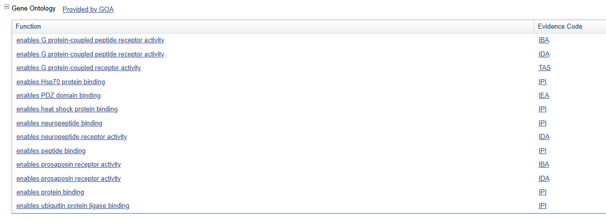
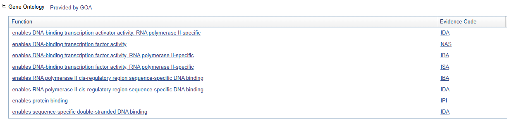
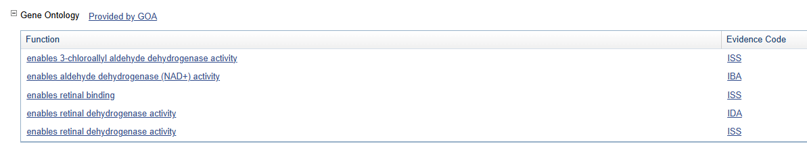
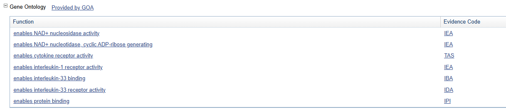

<!-- page number pos -->
\fancyhf{}
\fancyfoot[C]{\thepage}
\pagestyle{fancy}

<!-- no page nr on first page  -->
\pagenumbering{gobble}

<!-- Anger sidbrytning -->
\clearpage

<!-- creating the table of contents -->
\setcounter{tocdepth}{3}
\tableofcontents

<!-- new page -->
\clearpage

<!-- starting the count on 1 after the contents -->
\pagenumbering{arabic}
\setcounter{page}{1}

```{r, include = FALSE,message=FALSE}
knitr::opts_chunk$set(cache = TRUE)
set.seed(12345)
```

```{r libraries, message=FALSE, warning=FALSE}
if (!require("BiocManager", quietly = TRUE))
  install.packages("BiocManager")
BiocManager::install()
BiocManager::install("GEOquery")
library(GEOquery)

#ERROR: dependencies ‘affy’, ‘genefilter’, ‘gcrma’ are not available for package ‘simpleaffy’
BiocManager::install('affy')
BiocManager::install('affyPLM')
BiocManager::install('genefilter')
BiocManager::install('gcrma')
install.packages('./simpleaffy_2.50.0.tar.gz', type='source') #Needs Linux ?
library(simpleaffy)

library(RColorBrewer)

library(limma)

BiocManager::install('hgu133plus2.db')
library(hgu133plus2.db)

library(annotate)

library(ggplot2)
```

# Question 1

*Run all the R code and reproduce the graphics. Go carefully through the R code and explain in your words what each step does. HINT Recall what a design/model matrix is from linear regression.*


Loading the GEO data using `GEOquery` package. Extracting the downloaded raw `.tar` files into data directory.
Creating the phenotype data by generating a matrix and then converting it do a data frame. Manually adding `Targets` labels. Saves the phenotype data.

```{r 1.1}
# Important note: before knitting, delete the data folder
library(GEOquery)
x = getGEOSuppFiles("GSE20986")
x
untar("GSE20986/GSE20986_RAW.tar", exdir = "data")
cels = list.files("data/", pattern = "[gz]")
sapply(paste("data", cels, sep = "/"), gunzip)
phenodata = matrix(rep(list.files("data"), 2), ncol =2)
class(phenodata)
phenodata <- as.data.frame(phenodata)
colnames(phenodata) <- c("Name", "FileName")
phenodata$Targets <- c("iris", 
                       "retina", 
                       "retina", 
                       "iris", 
                       "retina", 
                       "iris", 
                       "choroid", 
                       "choroid", 
                       "choroid", 
                       "huvec", 
                       "huvec", 
                       "huvec")
write.table(phenodata, "data/phenodata.txt", quote = F, sep = "\t", row.names = F)
```


The `read.affy()` function loads the CEL files into an AffyBatch object. Then making a boxplot to show the distribution of raw intensity values for each samples.

```{r 1.2, warning=FALSE}
library(simpleaffy)
celfiles <- read.affy(covdesc = "phenodata.txt", path = "data")
boxplot(celfiles)
```

Extracting raw expression values (eset) from CEL files and name columns using sample labels. Then creating a boxplot of raw expression values with colors for better visualization.

```{r 1.3}
library(RColorBrewer)
cols = brewer.pal(8, "Set1")
eset <- exprs(celfiles)
samples <- celfiles$Targets
colnames(eset)
colnames(eset) <- samples
boxplot(celfiles, col = cols, las = 2)

```


Computes pairwise distances between samples using the maximum distance metric.
Doing hierarchical clustering and visualize it as a dendrogram to group samples by similarity.

```{r 1.4}
distance <- dist(t(eset), method = "maximum")
clusters <- hclust(distance)
plot(clusters)
```


```{r 1.5}
require(simpleaffy)
require(affyPLM)
```


Normalizing raw data using `gcrma()`. Then plotting two boxplots to compare the data before and after the normalization.

```{r 1.6}
celfiles.gcrma = gcrma(celfiles)
par(mfrow=c(1,2))
boxplot(celfiles.gcrma, col = cols, las = 2, main = "Post-Normalization");
boxplot(celfiles, col = cols, las = 2, main = "Pre-Normalization")
```


```{r 1.7}
#dev.off()
library(limma)
```

Converting the class labels to factors and create a design matrix for the linear model (rows = samples, columns = groups).
Specifying contrast for comparison between groups.


```{r 1.8}
phenodata
samples <- as.factor(samples)
design <- model.matrix(~0+samples)
colnames(design)

colnames(design) <- c("choroid", "huvec", "iris", "retina")
design

contrast.matrix = makeContrasts(
              huvec_choroid = huvec - choroid, 
              huvec_retina = huvec - retina, 
              huvec_iris = huvec - iris, 
              levels = design)

```


```{r 1.9}
library(hgu133plus2.db)

library(annotate)
```


Fitting the linear model using `lmFit()` and then computing the contrast from the linear model.
Using `eBayes()` to get empirical Bayes statistics for analysis.
Filter results based on statistical thresholds for significance and log fold change, then categorize into three classes, upregulated, downregulated, or non-significant.

```{r 1.10}

fit = lmFit(celfiles.gcrma, design)
huvec_fit <- contrasts.fit(fit, contrast.matrix)
huvec_ebay <- eBayes(huvec_fit)


probenames.list <- rownames(topTable(huvec_ebay, number = 100000))
getsymbols <- getSYMBOL(probenames.list, "hgu133plus2")
results1 <- topTable(huvec_ebay, number = 100000, coef = "huvec_choroid")
results1 <- cbind(results1, getsymbols)

summary(results)

results1$threshold <- "1"
a <- subset(results1, adj.P.Val < 0.05 & logFC > 5)
results1[rownames(a), "threshold"] <- "2"
b <- subset(results1, adj.P.Val < 0.05 & logFC < -5)
results1[rownames(b), "threshold"] <- "3"
table(results$threshold)
```


Creating a Volcano Plot using `ggplot()` with log fold change (logFC) on the x-axis and adjusted p-values on the y-axis (log-transformed). Color points by threshold categories (non-significant, upregulated, downregulated).
Annotate genes with high upregulation and significance.

```{r 1.11}
library(ggplot2)
volcano <- ggplot(data = results1, 
                  aes(x = logFC, y = -1*log10(adj.P.Val), 
                      colour = threshold, 
                      label = getsymbols))

volcano <- volcano + 
  geom_point() + 
  scale_color_manual(values = c("black", "red", "green"), 
                     labels = c("Not Significant", "Upregulated", "Downregulated"), 
                     name = "Key/Legend")

volcano + 
  geom_text(data = subset(results1, logFC > 5 & -1*log10(adj.P.Val) > 5), aes(x = logFC, y = -1*log10(adj.P.Val), colour = threshold, label = getsymbols)  )

```

\pagebreak 

# Question 2

In the presented analysis, there are no plots of raw paired data. In the section where the contrasts are defined find the three contrasts. Present the variables versus each other original, log–scaled and MA–plot for each considered pair both before and after normalization. A cluster analysis is performed on the page but not reported. Present plots and also draw heatmaps.

```{r lecture_code}
## This file accompanies the course 732A51 Bioinformatics 

## This software comes AS IS in the hope that it will be useful WITHOUT ANY WARRANTY, 
## NOT even the implied warranty of MERCHANTABILITY or FITNESS FOR A PARTICULAR PURPOSE. 
## Please understand that there may still be bugs and errors. Use it at your own risk. 
## We take no responsibility for any errors or omissions in this code or for any misfortune 
## that may befall you or others as a result of its use. Please send comments and report 
## bugs to Krzysztof Bartoszek at krzbar@protonmail.ch .


yx<-function(x,sdscale){abs(sapply(x,function(u,sdscale){rnorm(1,u,u/sdscale)},sdscale=sdscale,simplify=TRUE))};

plotlim<-12;sdscale<-4.5;plotlim2<-3
# 
# Cy3<-rexp(10000);
# Cy5<-yx(Cy3,sdscale)
# M<-log2(Cy5/Cy3)
# A<-(log2(Cy5)+log2(Cy3))/2
# 
# png("IdealMicroarray.png", width = 3*480, height = 480)
# par(mfrow=c(1,3))
# plot(Cy3,Cy5,pch=19,xlim=c(0,plotlim),ylim=c(0,plotlim),font.lab=2,xlab="Cy3",ylab="Cy5",cex.lab=1.5,cex.axis=1.5,font.axis=2);abline(a=0,b=0.5,lwd=2);abline(a=0,b=2,lwd=2);abline(a=0,b=1,lwd=2)
# 
# plot(log2(Cy3),log2(Cy5),pch=19,font.lab=2,xlab="log(Cy3)",ylab="log(Cy5)",cex.lab=1.5,cex.axis=1.5,font.axis=2);abline(a=-2,b=1,lwd=2);abline(a=2,b=1,lwd=2);abline(a=0,b=1,lwd=2)
# 
# plot(A,M,pch=19,font.lab=2,xlab="(logCy5+logCy3)/2",ylab="log(Cy5/Cy3)",xlim=c(-4*plotlim2,plotlim2),ylim=c(-plotlim2,plotlim2),cex.lab=1.5,cex.axis=1.5,font.axis=2);abline(a=2,b=0,lwd=2);abline(a=-2,b=0,lwd=2);abline(a=0,b=0,lwd=2)
#dev.off()

```


## huvec_choroid pair

```{r 2.1, warning=FALSE}

e <- exprs(celfiles)
par(mfrow=c(1,3))

Cy3 <- results1$logFC
Cy5 <- results2$logFC
M<-log2(Cy5/Cy3)
A<-(log2(Cy5)+log2(Cy3))/2

# Original
plot(Cy3,Cy5,pch=19,xlim=c(0,plotlim),ylim=c(0,plotlim),font.lab=2,xlab="Cy3",ylab="Cy5",cex.lab=1.5,cex.axis=1.5,font.axis=2);abline(a=0,b=0.5,lwd=2);abline(a=0,b=2,lwd=2);abline(a=0,b=1,lwd=2)
# Log-scaled
plot(log2(Cy3),log2(Cy5),pch=19,font.lab=2,xlab="log(Cy3)",ylab="log(Cy5)",cex.lab=1.5,cex.axis=1.5,font.axis=2);abline(a=-2,b=1,lwd=2);abline(a=2,b=1,lwd=2);abline(a=0,b=1,lwd=2)

# MA-plot
plot(A,M,pch=19,font.lab=2,xlab="(logCy5+logCy3)/2",ylab="log(Cy5/Cy3)",cex.lab=1.5,cex.axis=1.5,font.axis=2);abline(a=2,b=0,lwd=2);abline(a=-2,b=0,lwd=2);abline(a=0,b=0,lwd=2)

```

## huvec_iris pair

```{r 2.2, warning=FALSE}
Cy3 <- results1$logFC
Cy5 <- results3$logFC
M<-log2(Cy5/Cy3)
A<-(log2(Cy5)+log2(Cy3))/2
par(mfrow=c(1,3))

# Original
plot(Cy3,Cy5,pch=19,xlim=c(0,plotlim),ylim=c(0,plotlim),font.lab=2,xlab="Cy3",ylab="Cy5",cex.lab=1.5,cex.axis=1.5,font.axis=2);abline(a=0,b=0.5,lwd=2);abline(a=0,b=2,lwd=2);abline(a=0,b=1,lwd=2)
# Log-scaled
plot(log2(Cy3),log2(Cy5),pch=19,font.lab=2,xlab="log(Cy3)",ylab="log(Cy5)",cex.lab=1.5,cex.axis=1.5,font.axis=2);abline(a=-2,b=1,lwd=2);abline(a=2,b=1,lwd=2);abline(a=0,b=1,lwd=2)

# MA-plot
plot(A,M,pch=19,font.lab=2,xlab="(logCy5+logCy3)/2",ylab="log(Cy5/Cy3)",cex.lab=1.5,cex.axis=1.5,font.axis=2)
```


## huvec_retina pair

```{r 2.3, warning=FALSE}

Cy3 <- results3$logFC
Cy5 <- results2$logFC
M<-log2(Cy5/Cy3)
A<-(log2(Cy5)+log2(Cy3))/2
par(mfrow=c(1,3))

# Original
plot(Cy3,Cy5,pch=19,font.lab=2,xlab="Cy3",ylab="Cy5",cex.lab=1.5,cex.axis=1.5,font.axis=2)
# Log-scaled
plot(log2(Cy3),log2(Cy5),pch=19,font.lab=2,xlab="log(Cy3)",ylab="log(Cy5)",cex.lab=1.5,cex.axis=1.5,font.axis=2);abline(a=-2,b=1,lwd=2)
# MA-plot
plot(A,M,pch=19,font.lab=2,xlab="(logCy5+logCy3)/2",ylab="log(Cy5/Cy3)",cex.lab=1.5,cex.axis=1.5,font.axis=2)
```

## cluster analysis ?

\pagebreak 

# Question 3

The volcano plot is only for huvec versus choroid. Provide volcano plots for the other pairs. Indicate significantly differentially expressed genes. Explain how they are found.

## Huvec - Retina pair volcano plot

```{r 4.1}

results2 <- topTable(huvec_ebay, number = 100000, coef = "huvec_retina")
results2 <- cbind(results2, getsymbols)

summary(results2)

results2$threshold <- "1"
a <- subset(results2, adj.P.Val < 0.05 & logFC > 5)
results2[rownames(a), "threshold"] <- "2"
b <- subset(results2, adj.P.Val < 0.05 & logFC < -5)
results2[rownames(b), "threshold"] <- "3"
table(results2$threshold)

volcano <- ggplot(data = results2, 
                  aes(x = logFC, y = -1*log10(adj.P.Val), 
                      colour = threshold, 
                      label = getsymbols))

volcano <- volcano + 
  geom_point() + 
  scale_color_manual(values = c("black", "red", "green"), 
                     labels = c("Not Significant", "Upregulated", "Downregulated"), 
                     name = "Key/Legend")

volcano + 
  geom_text(data = subset(results2, logFC > 5 & -1*log10(adj.P.Val) > 5), aes(x = logFC, y = -1*log10(adj.P.Val), colour = threshold, label = getsymbols)  )

```

## Huvec - Iris pair volcano plot

```{r 4.2}

results3 <- topTable(huvec_ebay, number = 100000, coef = "huvec_iris")
results3 <- cbind(results3, getsymbols)

summary(results3)

results3$threshold <- "1"
a <- subset(results3, adj.P.Val < 0.05 & logFC > 5)
results3[rownames(a), "threshold"] <- "2"
b <- subset(results3, adj.P.Val < 0.05 & logFC < -5)
results3[rownames(b), "threshold"] <- "3"
table(results3$threshold)

volcano <- ggplot(data = results3, 
                  aes(x = logFC, y = -1*log10(adj.P.Val), 
                      colour = threshold, 
                      label = getsymbols))

volcano <- volcano + 
  geom_point() + 
  scale_color_manual(values = c("black", "red", "green"), 
                     labels = c("Not Significant", "Upregulated", "Downregulated"), 
                     name = "Key/Legend")

volcano + 
  geom_text(data = subset(results3, logFC > 5 & -1*log10(adj.P.Val) > 5), aes(x = logFC, y = -1*log10(adj.P.Val), colour = threshold, label = getsymbols)  )

```


\pagebreak 

# Question 4

Try to find more information on the genes that are reported to be significantly differentially expressed. The place to start off is https://www.ncbi.nlm.nih.gov/gene/, remember that the data is from the species human. Try to look also for other databases where (some) information on the genes may be found. Try to follow on some of the provided links. Report in your own words on what you find.
Report all the Gene Ontology (GO) terms associated with each gene. Are any of the GO terms common between genes? If so do the common GO terms seem to be related to anything particular? Try to present GO analysis in an informative manner, if possible visualize.


**HOXB7**:

- Offcial full name: homeobox B7

- Summary: "This gene is a member of the Antp homeobox family and encodes a protein with a homeobox DNA-binding domain. It is included in a cluster of homeobox B genes located on chromosome 17. The encoded nuclear protein functions as a sequence-specific transcription factor that is involved in cell proliferation and differentiation. Increased expression of this gene is associated with some cases of melanoma and ovarian carcinoma." (https://www.ncbi.nlm.nih.gov/gene/3217)

- GO terms (https://www.ncbi.nlm.nih.gov/gene/3217#gene-ontology):




**GPR37**:

- Offcial full name: G protein-coupled receptor 37

- Summary: "This gene is a member of the G protein-coupled receptor family. The encoded protein contains seven transmembrane domains and is found in cell and endoplasmic reticulum membranes. G protein-coupled receptors are involved in translating outside signals into G protein mediated intracellular effects. This gene product interacts with Parkin and is involved in juvenile Parkinson disease." (https://www.ncbi.nlm.nih.gov/gene/2861)

- GO terms (https://www.ncbi.nlm.nih.gov/gene/2861#gene-ontology):




\pagebreak

**ALDH1A2**:

- Offcial full name: aldehyde dehydrogenase 1 family member A2

- Summary: "This protein belongs to the aldehyde dehydrogenase family of proteins. The product of this gene is an enzyme that catalyzes the synthesis of retinoic acid (RA) from retinaldehyde. Retinoic acid, the active derivative of vitamin A (retinol), is a hormonal signaling molecule that functions in developing and adult tissues. The studies of a similar mouse gene suggest that this enzyme and the cytochrome CYP26A1, concurrently establish local embryonic retinoic acid levels which facilitate posterior organ development and prevent spina bifida. Four transcript variants encoding distinct isoforms have been identified for this gene." (https://www.ncbi.nlm.nih.gov/gene/8854)

- GO terms (https://www.ncbi.nlm.nih.gov/gene/8854#gene-ontology):




**IL1RL1**:

- Offcial full name: interleukin 1 receptor like 1

- Summary: "The protein encoded by this gene is a member of the interleukin 1 receptor family. Studies of the similar gene in mouse suggested that this receptor can be induced by proinflammatory stimuli, and may be involved in the function of helper T cells. This gene, interleukin 1 receptor, type I (IL1R1), interleukin 1 receptor, type II (IL1R2) and interleukin 1 receptor-like 2 (IL1RL2) form a cytokine receptor gene cluster in a region mapped to chromosome 2q12. Alternative splicing of this gene results in multiple transcript variants." (https://www.ncbi.nlm.nih.gov/gene/9173)

- GO terms (https://www.ncbi.nlm.nih.gov/gene/9173#gene-ontology):




The common Gene Ontology (GO) term "Enables protein binding" appears across the following genes:
HOXB7, GPR37 and  IL1RL1.

Protein Binding is a important molecular function that allows proteins to interact with other molecules such as enzymes, receptor proteins. This GO term being common across these genes suggests that all the involved proteins might play significant roles in cellular signaling, metabolism, and structural processes.


