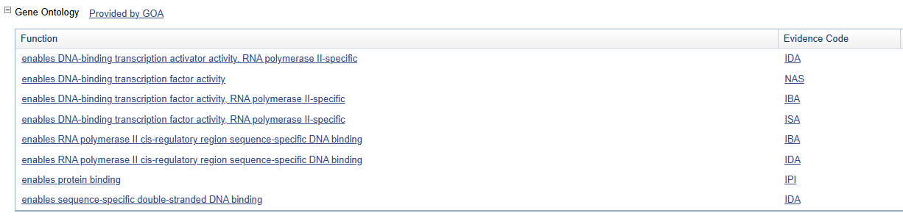
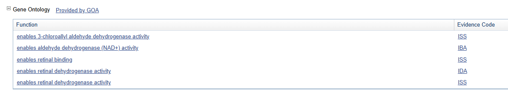
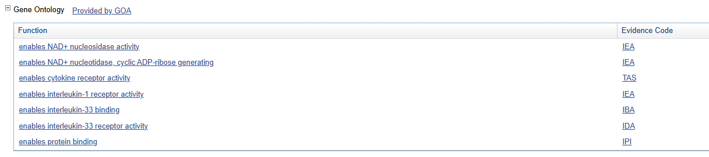

<!-- page number pos -->
\fancyhf{}
\fancyfoot[C]{\thepage}
\pagestyle{fancy}

<!-- no page nr on first page  -->
\pagenumbering{gobble}

<!-- Anger sidbrytning -->
\clearpage

<!-- creating the table of contents -->
\setcounter{tocdepth}{3}
\tableofcontents

<!-- new page -->
\clearpage

<!-- starting the count on 1 after the contents -->
\pagenumbering{arabic}
\setcounter{page}{1}


``` r
# if (!require("BiocManager", quietly = TRUE))
#   install.packages("BiocManager")
# BiocManager::install()
# BiocManager::install("GEOquery")
library(GEOquery)

#ERROR: dependencies ‘affy’, ‘genefilter’, ‘gcrma’ are not available for package ‘simpleaffy’
# BiocManager::install('affy')
# BiocManager::install('affyPLM')
# BiocManager::install('genefilter')
# BiocManager::install('gcrma')
# install.packages('./simpleaffy_2.50.0.tar.gz', type='source') #Needs Linux ?

library(simpleaffy)
library(RColorBrewer)
library(limma)

#BiocManager::install('hgu133plus2.db')
library(hgu133plus2.db)
library(annotate)
library(ggplot2)
```

# Question 1

*Run all the R code and reproduce the graphics. Go carefully through the R code and explain in your words what each step does. HINT Recall what a design/model matrix is from linear regression.*


Loading the GEO data using `GEOquery` package. Extracting the downloaded raw `.tar` files into data directory.
Creating the phenotype data by generating a matrix and then converting it do a data frame. Manually adding `Targets` labels. Saves the phenotype data.


``` r
# Important note: before knitting, delete the data folder
library(GEOquery)
x = getGEOSuppFiles("GSE20986")
x
```

```
##                                                                         size
## /home/h/Documents/LiU/Bioinformatics/Lab4/GSE20986/GSE20986_RAW.tar 56360960
##                                                                     isdir mode
## /home/h/Documents/LiU/Bioinformatics/Lab4/GSE20986/GSE20986_RAW.tar FALSE  664
##                                                                                   mtime
## /home/h/Documents/LiU/Bioinformatics/Lab4/GSE20986/GSE20986_RAW.tar 2024-12-10 14:21:55
##                                                                                   ctime
## /home/h/Documents/LiU/Bioinformatics/Lab4/GSE20986/GSE20986_RAW.tar 2024-12-10 14:21:55
##                                                                                   atime
## /home/h/Documents/LiU/Bioinformatics/Lab4/GSE20986/GSE20986_RAW.tar 2024-12-10 14:20:37
##                                                                      uid  gid
## /home/h/Documents/LiU/Bioinformatics/Lab4/GSE20986/GSE20986_RAW.tar 1000 1000
##                                                                     uname
## /home/h/Documents/LiU/Bioinformatics/Lab4/GSE20986/GSE20986_RAW.tar     h
##                                                                     grname
## /home/h/Documents/LiU/Bioinformatics/Lab4/GSE20986/GSE20986_RAW.tar      h
```

``` r
untar("GSE20986/GSE20986_RAW.tar", exdir = "data")
cels = list.files("data/", pattern = "[gz]")
sapply(paste("data", cels, sep = "/"), gunzip)
```

```
## data/GSM524662.CEL.gz data/GSM524663.CEL.gz data/GSM524664.CEL.gz 
##              13555726              13555055              13555639 
## data/GSM524665.CEL.gz data/GSM524666.CEL.gz data/GSM524667.CEL.gz 
##              13560122              13555663              13557614 
## data/GSM524668.CEL.gz data/GSM524669.CEL.gz data/GSM524670.CEL.gz 
##              13556090              13560054              13555971 
## data/GSM524671.CEL.gz data/GSM524672.CEL.gz data/GSM524673.CEL.gz 
##              13554926              13555042              13555290
```

``` r
phenodata = matrix(rep(list.files("data"), 2), ncol =2)
class(phenodata)
```

```
## [1] "matrix" "array"
```

``` r
phenodata <- as.data.frame(phenodata)
colnames(phenodata) <- c("Name", "FileName")
phenodata$Targets <- c("iris", 
                       "retina", 
                       "retina", 
                       "iris", 
                       "retina", 
                       "iris", 
                       "choroid", 
                       "choroid", 
                       "choroid", 
                       "huvec", 
                       "huvec", 
                       "huvec")
write.table(phenodata, "data/phenodata.txt", quote = F, sep = "\t", row.names = F)
```


The `read.affy()` function loads the CEL files into an AffyBatch object. Then making a boxplot to show the distribution of raw intensity values for each samples.


``` r
library(simpleaffy)
celfiles <- read.affy(covdesc = "phenodata.txt", path = "data")
boxplot(celfiles)
```

```
## 
```

<!-- --> 

Extracting raw expression values (eset) from CEL files and name columns using sample labels. Then creating a boxplot of raw expression values with colors for better visualization.


``` r
library(RColorBrewer)
cols = brewer.pal(8, "Set1")
eset <- exprs(celfiles)
samples <- celfiles$Targets
colnames(eset)
```

```
##  [1] "GSM524662.CEL" "GSM524663.CEL" "GSM524664.CEL" "GSM524665.CEL"
##  [5] "GSM524666.CEL" "GSM524667.CEL" "GSM524668.CEL" "GSM524669.CEL"
##  [9] "GSM524670.CEL" "GSM524671.CEL" "GSM524672.CEL" "GSM524673.CEL"
```

``` r
colnames(eset) <- samples
boxplot(celfiles, col = cols, las = 2)
```

<!-- --> 


Computes pairwise distances between samples using the maximum distance metric.
Doing hierarchical clustering and visualize it as a dendrogram to group samples by similarity.


``` r
distance <- dist(t(eset), method = "maximum")
clusters <- hclust(distance)
plot(clusters)
```

<!-- --> 


``` r
require(simpleaffy)
require(affyPLM)
```

```
## Loading required package: affyPLM
```

```
## Loading required package: preprocessCore
```


Normalizing raw data using `gcrma()`. Then plotting two boxplots to compare the data before and after the normalization.


``` r
celfiles.gcrma = gcrma(celfiles)
```

```
## Adjusting for optical effect............Done.
## Computing affinities.Done.
## Adjusting for non-specific binding............Done.
## Normalizing
## Calculating Expression
```

``` r
par(mfrow=c(1,2))
boxplot(celfiles.gcrma, col = cols, las = 2, main = "Post-Normalization");
boxplot(celfiles, col = cols, las = 2, main = "Pre-Normalization")
```

<!-- --> 


``` r
library(limma)
```

Converting the class labels to factors and create a design matrix for the linear model (rows = samples, columns = groups).
Specifying contrast for comparison between groups.


``` r
phenodata
```

```
##             Name      FileName Targets
## 1  GSM524662.CEL GSM524662.CEL    iris
## 2  GSM524663.CEL GSM524663.CEL  retina
## 3  GSM524664.CEL GSM524664.CEL  retina
## 4  GSM524665.CEL GSM524665.CEL    iris
## 5  GSM524666.CEL GSM524666.CEL  retina
## 6  GSM524667.CEL GSM524667.CEL    iris
## 7  GSM524668.CEL GSM524668.CEL choroid
## 8  GSM524669.CEL GSM524669.CEL choroid
## 9  GSM524670.CEL GSM524670.CEL choroid
## 10 GSM524671.CEL GSM524671.CEL   huvec
## 11 GSM524672.CEL GSM524672.CEL   huvec
## 12 GSM524673.CEL GSM524673.CEL   huvec
```

``` r
samples <- as.factor(samples)
design <- model.matrix(~0+samples)
colnames(design)
```

```
## [1] "sampleschoroid" "sampleshuvec"   "samplesiris"    "samplesretina"
```

``` r
colnames(design) <- c("choroid", "huvec", "iris", "retina")
design
```

```
##    choroid huvec iris retina
## 1        0     0    1      0
## 2        0     0    0      1
## 3        0     0    0      1
## 4        0     0    1      0
## 5        0     0    0      1
## 6        0     0    1      0
## 7        1     0    0      0
## 8        1     0    0      0
## 9        1     0    0      0
## 10       0     1    0      0
## 11       0     1    0      0
## 12       0     1    0      0
## attr(,"assign")
## [1] 1 1 1 1
## attr(,"contrasts")
## attr(,"contrasts")$samples
## [1] "contr.treatment"
```

``` r
contrast.matrix = makeContrasts(
              huvec_choroid = huvec - choroid, 
              huvec_retina = huvec - retina, 
              huvec_iris = huvec - iris, 
              levels = design)
```


``` r
library(hgu133plus2.db)
library(annotate)
```


Fitting the linear model using `lmFit()` and then computing the contrast from the linear model.
Using `eBayes()` to get empirical Bayes statistics for analysis.
Filter results based on statistical thresholds for significance and log fold change, then categorize into three classes, upregulated, downregulated, or non-significant.


``` r
fit = lmFit(celfiles.gcrma, design)
huvec_fit <- contrasts.fit(fit, contrast.matrix)
huvec_ebay <- eBayes(huvec_fit)


probenames.list <- rownames(topTable(huvec_ebay, number = 100000))
getsymbols <- getSYMBOL(probenames.list, "hgu133plus2")
results1 <- topTable(huvec_ebay, number = 100000, coef = "huvec_choroid")
results1 <- cbind(results1, getsymbols)

summary(results1)
```

```
##      logFC             AveExpr             t                P.Value      
##  Min.   :-9.19178   Min.   : 2.279   Min.   :-39.77095   Min.   :0.0000  
##  1st Qu.:-0.05972   1st Qu.: 2.281   1st Qu.: -0.70703   1st Qu.:0.1522  
##  Median : 0.00000   Median : 2.480   Median :  0.00000   Median :0.5080  
##  Mean   :-0.02355   Mean   : 4.375   Mean   :  0.07445   Mean   :0.5345  
##  3rd Qu.: 0.03970   3rd Qu.: 6.241   3rd Qu.:  0.67369   3rd Qu.:1.0000  
##  Max.   : 8.66974   Max.   :15.542   Max.   :295.37719   Max.   :1.0000  
##    adj.P.Val            B           getsymbols       
##  Min.   :0.0000   Min.   :-7.711   Length:54675      
##  1st Qu.:0.6036   1st Qu.:-7.711   Class :character  
##  Median :1.0000   Median :-7.452   Mode  :character  
##  Mean   :0.7436   Mean   :-6.583                     
##  3rd Qu.:1.0000   3rd Qu.:-6.498                     
##  Max.   :1.0000   Max.   :21.296
```

``` r
results1$threshold <- "1"
a <- subset(results1, adj.P.Val < 0.05 & logFC > 5)
results1[rownames(a), "threshold"] <- "2"
b <- subset(results1, adj.P.Val < 0.05 & logFC < -5)
results1[rownames(b), "threshold"] <- "3"
table(results1$threshold)
```

```
## 
##     1     2     3 
## 54587    33    55
```


Creating a Volcano Plot using `ggplot()` with log fold change (logFC) on the x-axis and adjusted p-values on the y-axis (log-transformed). Color points by threshold categories (non-significant, upregulated, downregulated).
Annotate genes with high upregulation and significance.


``` r
library(ggplot2)
volcano <- ggplot(data = results1, 
                  aes(x = logFC, y = -1*log10(adj.P.Val), 
                      colour = threshold, 
                      label = getsymbols))

volcano <- volcano + 
  geom_point() + 
  scale_color_manual(values = c("black", "red", "green"), 
                     labels = c("Not Significant", "Upregulated", "Downregulated"), 
                     name = "Key/Legend")

volcano + 
  geom_text(data = subset(results1, logFC > 5 & -1*log10(adj.P.Val) > 5), aes(x = logFC, y = -1*log10(adj.P.Val), colour = threshold, label = getsymbols)  ) + theme_bw()
```

```
## Warning: Removed 2 rows containing missing values (`geom_text()`).
```

<!-- --> 

\pagebreak 

# Question 2

In the presented analysis, there are no plots of raw paired data. In the section where the contrasts are defined find the three contrasts. Present the variables versus each other original, log–scaled and MA–plot for each considered pair both before and after normalization. A cluster analysis is performed on the page but not reported. Present plots and also draw heatmaps.


``` r
samples <- celfiles$Targets

# pre norm
eset <- exprs(celfiles)
colnames(eset) <- samples

# post norm
eset_post <- exprs(celfiles.gcrma)
colnames(eset_post) <- samples


# Orginal
choroid <- eset[, samples == "choroid"]
huvec <- eset[, samples == "huvec"] 
iris <- eset[, samples == "iris"]
retina <- eset[, samples == "retina"]

# Log
choroid_log <- log2(eset[, samples == "choroid"])
huvec_log <- log2(eset[, samples == "huvec"])
iris_log <- log2(eset[, samples == "iris"])
retina_log <- log2(eset[, samples == "retina"])


# Post norm 
choroid_post <- eset_post[, samples == "choroid"]
huvec_post <- eset_post[, samples == "huvec"] 
iris_post <- eset_post[, samples == "iris"]
retina_post <- eset_post[, samples == "retina"]
```

## huvec_choroid pair


``` r
# Orginal and Log Scale
par(mfrow = c(1,2))
plot(huvec, choroid, xlab = "huvec", ylab = "chorid", main = "Orginal scale")
plot(huvec_log, choroid_log, xlab = "huvec", ylab = "chorid", main = "Log scale")
```

<!-- --> 


``` r
M <- log2(choroid/huvec)
A <- (log2(choroid)+log2(huvec))/2

M_post <- log2(choroid_post/huvec_post)
A_post <- (log2(choroid_post)+log2(huvec_post))/2

par(mfrow = c(1,2))
plot(A,M, pch = 19, font.lab = 2, xlab = "A = (choroid_log+huvec_log)/2",
     ylab = "M = log(choroid/huvec)", main = "MA (Pre norm)")

plot(A_post,M_post, pch = 19, font.lab = 2, xlab = "A = (choroid_log+huvec_log)/2",
     ylab = "M = log(choroid/huvec)", main = "MA (Post norm)")
```

<!-- --> 

## huvec_iris pair


``` r
# Orginal and Log Scale
par(mfrow = c(1,2))
plot(huvec, iris, xlab = "huvec", ylab = "iris", main = "Orginal scale")
plot(huvec_log, iris_log, xlab = "huvec", ylab = "iris", main = "Log scale")
```

<!-- --> 

``` r
M <- log2(iris/huvec)
A <- (log2(iris)+log2(huvec))/2

M_post <- log2(iris_post/huvec_post)
A_post <- (log2(iris_post)+log2(huvec_post))/2

par(mfrow = c(1,2))
plot(A,M, pch = 19, font.lab = 2, xlab = "A = (iris_log+huvec_log)/2",
     ylab = "M = log(iris/huvec)", main = "MA (Pre norm)")

plot(A_post,M_post, pch = 19, font.lab = 2, xlab = "A = (iris_log+huvec_log)/2",
     ylab = "M = log(iris/huvec)", main = "MA (Post norm)")
```

<!-- --> 


## huvec_retina pair


``` r
# Orginal and Log Scale
par(mfrow = c(1,2))
plot(huvec, retina, xlab = "huvec", ylab = "retina", main = "Orginal scale")
plot(huvec_log, retina_log, xlab = "huvec", ylab = "retina", main = "Log scale")
```

<!-- --> 


``` r
M <- log2(retina/huvec)
A <- (log2(retina)+log2(huvec))/2

M_post <- log2(retina_post/huvec_post)
A_post <- (log2(retina_post)+log2(huvec_post))/2

par(mfrow = c(1,2))
plot(A,M, pch = 19, font.lab = 2, xlab = "A = (reting_log+huvec_log)/2",
     ylab = "M = log(retina/huvec)", main = "MA (Pre norm)")

plot(A_post,M_post, pch = 19, font.lab = 2, xlab = "A = (reting_log+huvec_log)/2",
     ylab = "M = log(retina/huvec)", main = "MA (Post norm)")
```

<!-- --> 


## cluster analysis 


``` r
distance <- dist(t(eset), method = "maximum")
clusters <- hclust(distance)
plot(clusters, main = "Cluster dendogram (Pre norm)")
```

<!-- --> 


``` r
distance <- dist(t(eset_post), method = "maximum")
clusters <- hclust(distance)
plot(clusters, main = "Cluster dendogram (Post norm)")
```

<!-- --> 


## Heatmaps


``` r
distance <- dist(t(eset), method = "maximum")
heatmap(as.matrix(distance), main = "Heatmap (Pre norm)")
```

<!-- --> 


``` r
distance <- dist(t(eset_post), method = "maximum")
heatmap(as.matrix(distance), main = "Heatmap (Post norm)")
```

<!-- --> 


\pagebreak 

# Question 3

The volcano plot is only for huvec versus choroid. Provide volcano plots for the other pairs. Indicate significantly differentially expressed genes. Explain how they are found.

## Huvec - Retina pair volcano plot


``` r
results2 <- topTable(huvec_ebay, number = 100000, coef = "huvec_retina")
results2 <- cbind(results2, getsymbols)

summary(results2)
```

```
##      logFC              AveExpr             t                P.Value      
##  Min.   :-10.97732   Min.   : 2.279   Min.   :-40.22393   Min.   :0.0000  
##  1st Qu.: -0.05040   1st Qu.: 2.281   1st Qu.: -0.60808   1st Qu.:0.1564  
##  Median :  0.00000   Median : 2.480   Median :  0.00000   Median :0.5236  
##  Mean   : -0.03206   Mean   : 4.375   Mean   :  0.08633   Mean   :0.5414  
##  3rd Qu.:  0.04602   3rd Qu.: 6.241   3rd Qu.:  0.72407   3rd Qu.:1.0000  
##  Max.   :  8.66974   Max.   :15.542   Max.   :295.37719   Max.   :1.0000  
##    adj.P.Val            B           getsymbols       
##  Min.   :0.0000   Min.   :-7.711   Length:54675      
##  1st Qu.:0.6127   1st Qu.:-7.711   Class :character  
##  Median :1.0000   Median :-7.470   Mode  :character  
##  Mean   :0.7525   Mean   :-6.615                     
##  3rd Qu.:1.0000   3rd Qu.:-6.523                     
##  Max.   :1.0000   Max.   :21.295
```

``` r
results2$threshold <- "1"
a <- subset(results2, adj.P.Val < 0.05 & logFC > 5)
results2[rownames(a), "threshold"] <- "2"
b <- subset(results2, adj.P.Val < 0.05 & logFC < -5)
results2[rownames(b), "threshold"] <- "3"
table(results2$threshold)
```

```
## 
##     1     2     3 
## 54557    24    94
```

``` r
volcano <- ggplot(data = results2, 
                  aes(x = logFC, y = -1*log10(adj.P.Val), 
                      colour = threshold, 
                      label = getsymbols))

volcano <- volcano + 
  geom_point() + 
  scale_color_manual(values = c("black", "red", "green"), 
                     labels = c("Not Significant", "Upregulated", "Downregulated"), 
                     name = "Key/Legend")

volcano + 
  geom_text(data = subset(results2, logFC > 5 & -1*log10(adj.P.Val) > 5), aes(x = logFC, y = -1*log10(adj.P.Val), colour = threshold, label = getsymbols)  ) + theme_bw()
```

```
## Warning: Removed 2 rows containing missing values (`geom_text()`).
```

<!-- --> 

## Huvec - Iris pair volcano plot


``` r
results3 <- topTable(huvec_ebay, number = 100000, coef = "huvec_iris")
results3 <- cbind(results3, getsymbols)

summary(results3)
```

```
##      logFC             AveExpr             t                P.Value      
##  Min.   :-8.26522   Min.   : 2.279   Min.   :-42.51679   Min.   :0.0000  
##  1st Qu.:-0.08707   1st Qu.: 2.281   1st Qu.: -1.14357   1st Qu.:0.1252  
##  Median : 0.00000   Median : 2.480   Median :  0.00000   Median :0.3679  
##  Mean   :-0.02250   Mean   : 4.375   Mean   : -0.00822   Mean   :0.4888  
##  3rd Qu.: 0.03889   3rd Qu.: 6.241   3rd Qu.:  0.66191   3rd Qu.:1.0000  
##  Max.   : 8.66974   Max.   :15.542   Max.   :295.37719   Max.   :1.0000  
##    adj.P.Val            B           getsymbols       
##  Min.   :0.0000   Min.   :-7.711   Length:54675      
##  1st Qu.:0.5007   1st Qu.:-7.711   Class :character  
##  Median :0.7358   Median :-7.231   Mode  :character  
##  Mean   :0.6797   Mean   :-6.441                     
##  3rd Qu.:1.0000   3rd Qu.:-6.320                     
##  Max.   :1.0000   Max.   :21.295
```

``` r
results3$threshold <- "1"
a <- subset(results3, adj.P.Val < 0.05 & logFC > 5)
results3[rownames(a), "threshold"] <- "2"
b <- subset(results3, adj.P.Val < 0.05 & logFC < -5)
results3[rownames(b), "threshold"] <- "3"
table(results3$threshold)
```

```
## 
##     1     2     3 
## 54601    25    49
```

``` r
volcano <- ggplot(data = results3, 
                  aes(x = logFC, y = -1*log10(adj.P.Val), 
                      colour = threshold, 
                      label = getsymbols))

volcano <- volcano + 
  geom_point() + 
  scale_color_manual(values = c("black", "red", "green"), 
                     labels = c("Not Significant", "Upregulated", "Downregulated"), 
                     name = "Key/Legend")

volcano + 
  geom_text(data = subset(results3, logFC > 5 & -1*log10(adj.P.Val) > 5), aes(x = logFC, y = -1*log10(adj.P.Val), colour = threshold, label = getsymbols)  ) + theme_bw()
```

```
## Warning: Removed 2 rows containing missing values (`geom_text()`).
```

<!-- --> 


\pagebreak 

# Question 4

Try to find more information on the genes that are reported to be significantly differentially expressed. The place to start off is https://www.ncbi.nlm.nih.gov/gene/, remember that the data is from the species human. Try to look also for other databases where (some) information on the genes may be found. Try to follow on some of the provided links. Report in your own words on what you find.
Report all the Gene Ontology (GO) terms associated with each gene. Are any of the GO terms common between genes? If so do the common GO terms seem to be related to anything particular? Try to present GO analysis in an informative manner, if possible visualize.


**HOXB7**:

- Offcial full name: homeobox B7

- Summary: "This gene is a member of the Antp homeobox family and encodes a protein with a homeobox DNA-binding domain. It is included in a cluster of homeobox B genes located on chromosome 17. The encoded nuclear protein functions as a sequence-specific transcription factor that is involved in cell proliferation and differentiation. Increased expression of this gene is associated with some cases of melanoma and ovarian carcinoma." (https://www.ncbi.nlm.nih.gov/gene/3217)

- GO terms (https://www.ncbi.nlm.nih.gov/gene/3217#gene-ontology):


**GPR37**:

- Offcial full name: G protein-coupled receptor 37

- Summary: "This gene is a member of the G protein-coupled receptor family. The encoded protein contains seven transmembrane domains and is found in cell and endoplasmic reticulum membranes. G protein-coupled receptors are involved in translating outside signals into G protein mediated intracellular effects. This gene product interacts with Parkin and is involved in juvenile Parkinson disease." (https://www.ncbi.nlm.nih.gov/gene/2861)

- GO terms (https://www.ncbi.nlm.nih.gov/gene/2861#gene-ontology):




\pagebreak

**ALDH1A2**:

- Offcial full name: aldehyde dehydrogenase 1 family member A2

- Summary: "This protein belongs to the aldehyde dehydrogenase family of proteins. The product of this gene is an enzyme that catalyzes the synthesis of retinoic acid (RA) from retinaldehyde. Retinoic acid, the active derivative of vitamin A (retinol), is a hormonal signaling molecule that functions in developing and adult tissues. The studies of a similar mouse gene suggest that this enzyme and the cytochrome CYP26A1, concurrently establish local embryonic retinoic acid levels which facilitate posterior organ development and prevent spina bifida. Four transcript variants encoding distinct isoforms have been identified for this gene." (https://www.ncbi.nlm.nih.gov/gene/8854)

- GO terms (https://www.ncbi.nlm.nih.gov/gene/8854#gene-ontology):




**IL1RL1**:

- Offcial full name: interleukin 1 receptor like 1

- Summary: "The protein encoded by this gene is a member of the interleukin 1 receptor family. Studies of the similar gene in mouse suggested that this receptor can be induced by proinflammatory stimuli, and may be involved in the function of helper T cells. This gene, interleukin 1 receptor, type I (IL1R1), interleukin 1 receptor, type II (IL1R2) and interleukin 1 receptor-like 2 (IL1RL2) form a cytokine receptor gene cluster in a region mapped to chromosome 2q12. Alternative splicing of this gene results in multiple transcript variants." (https://www.ncbi.nlm.nih.gov/gene/9173)

- GO terms (https://www.ncbi.nlm.nih.gov/gene/9173#gene-ontology):




The common Gene Ontology (GO) term "Enables protein binding" appears across the following genes:
HOXB7, GPR37 and  IL1RL1.

Protein Binding is a important molecular function that allows proteins to interact with other molecules such as enzymes, receptor proteins. This GO term being common across these genes suggests that all the involved proteins might play significant roles in cellular signaling, metabolism, and structural processes.


