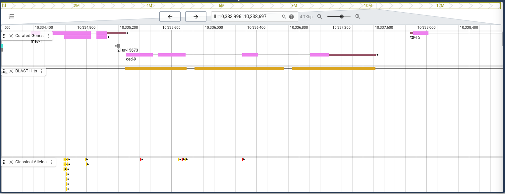

<!-- page number pos -->
\fancyhf{}
\fancyfoot[C]{\thepage}
\pagestyle{fancy}

<!-- no page nr on first page  -->
\pagenumbering{gobble}

<!-- Anger sidbrytning -->
\clearpage

<!-- creating the table of contents -->
\setcounter{tocdepth}{3}
\tableofcontents

<!-- new page -->
\clearpage

<!-- starting the count on 1 after the contents -->
\pagenumbering{arabic}
\setcounter{page}{1}

```{r, include = FALSE,message=FALSE}

# Q1 ###########################################################################
set.seed(12345)

library(ggplot2)
library(dplyr)
```


# Question 1

We consider a gene locus with two possible alleles (say $A$ and $a$) and a diploid population with $N$ individuals. Hence, there are 2$N$ alleles in the population. Let $p$ be the proportion of $A$s in the allele population and $q$ the population of as (of course $p$ + $q$ = 1). A population is said to be in Hardy-Weinberg equilibrium if the proportion of $AA$ homozygotes is $p^2$, aa homozygotes is $q^2$ and the proportion of heterozygotes ($Aa$) is $2pq$.


<!-- alleles = gener -->
<!-- mating = parning -->


## Question 1.1

Show that with random mating (i.e. both alleles of the o spring are just randomly, with proportions $p$ and $q$, drawn from the parental allele population) Hardy-Weinberg equilibrium is attained in the first generation. What is the proportion of $A$ and $a$ alleles in the offspring population?
Hence, with random mating, can a population in Hardy-Weinberg equilibrium ever deviate from
it?

**Answer:**

If the mating is random then all individuals inherits alleles independently with probabilities $p$ and $q$ from each parent. Then:

$$P(AA) = p\cdot p =p^2$$
$$P(aa) = q\cdot q= q^2$$
$$P(Aa) = (p \cdot q) + (p \cdot q) = 2pq$$

<!-- ?? -->

With random mating, a population in Hardy-Weinberg equilibrium will in theory stay in equilibrium.


## Question 1.2

We look at the MN blood group, it has two possible codominating (both contribute to heterozygotes) alleles $L^M$ (denoted $M$) and $L^N$ (denoted $N$). In a population of 1000 Americans of Caucasian descent the following genotype counts were observed, 357 individuals were $MM$, 485 were $MN$ and 158 were $NN$. Use a chisquare goodness of t test to test if the population is in Hardy-Weinberg equilibrium.


```{r}

MM <- 357
MN <- 485
NN <- 158

population <- 1000

# p = the proportion of Ms in the allele population 
p <- (2 * MM + MN) / (2 * population)
q <- 1 - p

# Hardy-Weinberg equilibrium
HW_MM <- p**2  * population
HW_NN <- q**2  * population
HW_MN <- q * p * population * 2


# chisq = sum[(Observed - Expected)^2 / (Expected)]
chisq <- sum( (c(MM, MN, NN) - c(HW_MM, HW_MN, HW_NN))^2 / (c(HW_MM, HW_MN, HW_NN)) )

p_value <- pchisq(chisq, df = 2, lower.tail = FALSE)
p_value

```

The null hypothesis is that the population is in Hardy-Weinberg equilibrium. After running the chi square test, there is no significant evidence to reject the null hypothesis, which means that we can not assume the population is NOT in Hardy-Weinberg equilibrium. Hence, we can conclude that the population is likely in Hardy-Weinberg equilibrium.


\newpage


# Question 2

In this exercise, you will use GenBank (https://www.ncbi.nlm.nih.gov/genbank/) with the default “Nucleotide” database. We will be interested in the sequence with accession number in GenBank: MK465080. You will find the relevant information in the FEATURES section of the returned record and access the nucleotides of the sequence under CDS (protein coding sequence, from CoDing Sequence). Remember that the coding strand (https://en.wikipedia.org/wiki/Coding_strand) is the strand of the gene that is identical to the transcript (see the lecture slides for the genetic code—translation of DNA triples to amino acids). The complimentary to it strand is called the template strand.

## Question 2.1

From what species does the sequence come from? Name the protein product of the CDS.

**Answer:** The sequence comes from the species *Branchipus schaefferi* and the protein product is named *cytochrome c oxidase subunit I*


## Question 2.2

Save (and submit) the nucleotide sequence of the coding strand that corresponds to these amino acids as a FASTA format file.. Use transeq (https://www.ebi.ac.uk/Tools/st/emboss_transeq/) to translate the nucleotides to a protein. Do you obtain the same protein sequence? Check what is the ORF and codon table (these are provided by GenBank in the FEATURES section). Use backtranseq (https://www.ebi.ac.uk/Tools/st/emboss_backtranseq/) to obtain the sequence from the protein sequence.

**Answer:**

>MK465080.1 Branchipus schaefferi isolate ST2-2 cytochrome c oxidase subunit I (COI) gene, partial cds; mitochondrial

`TCTCCTAGGAGATGACCAACTTTATAACGTCATTGTTACTGCTCACGCTTTTGTAATGATTTTCTTCATA`

`GTTATACCAATCCTTATTGGAGGATTTGGAAATTGATTAGTCCCTTTAATACTAGGGGCTCCTGATATGG`

`CTTTCCCCCGACTAAATAACTTAAGCTTTTGAATACTTCCTCCCTCATTAACTCTTCTAGTGGCCAGCTC`

`AATGGTAGAAAGAGGGGTAGGAACAGGATGAACAGTTTATCCACCCCTATCTGCTGCTATTGCCCATGCT`

`GGTCCTTCTGTTGATTTAGCAATCTTTTCACTTCACCTCGCAGGGATCTCTTCAATTTTAGGAGCTGTAA`

`ATTTCATTACAACTGTAATTAATATACGGCCTCATTCCATAAGATTAGACCGAATACCTTTATTTGCATG`

`AGCGGTAGTTATCACAGCAGTTCTTCTTCTCCTTTCTCTCCCAGTATTAGCAG`


**From Genbank database:**

/protein_id="QDG08361.1"
/translation="

`LLGDDQLYNVIVTAHAFVMIFFMVMPILIGGFGNWLVPLMLGAPDMAFPRLNNLSFWMLPPSLTLLVASS`

`MVESGVGTGWTVYPPLSAAIAHAGPSVDLAIFSLHLAGISSILGAVNFITTVINMRPHSMSLDRMPLFAW`

`AVVITAVLLLLSLPVLA`

                     
**From transeq :**

>MK465080.1_2 Branchipus schaefferi isolate ST2-2 cytochrome c oxidase subunit I (COI) gene, partial cds; mitochondrial

`LLGDDQLYNVIVTAHAFVMIFFMVMPILIGGFGNWLVPLMLGAPDMAFPRLNNLSFWMLPPSLTLLVASS`

`MVESGVGTGWTVYPPLSAAIAHAGPSVDLAIFSLHLAGISSILGAVNFITTVINMRPHSMSLDRMPLFAW`

`AVVITAVLLLLSLPVLAX`


```{r}
# Checking that the protein sequences are identical

pro1 <- "LLGDDQLYNVIVTAHAFVMIFFMVMPILIGGFGNWLVPLMLGAPDMAFPRLNNLSFWMLPPSLTLLVASSMVESGVGTGWTVYPPLSAAIAHAGPSVDLAIFSLHLAGISSILGAVNFITTVINMRPHSMSLDRMPLFAWAVVITAVLLLLSLPVLA" 

# removed the last character "X"
pro2 <- "LLGDDQLYNVIVTAHAFVMIFFMVMPILIGGFGNWLVPLMLGAPDMAFPRLNNLSFWMLPPSLTLLVASSMVESGVGTGWTVYPPLSAAIAHAGPSVDLAIFSLHLAGISSILGAVNFITTVINMRPHSMSLDRMPLFAWAVVITAVLLLLSLPVLA"

pro1 == pro2

```

We obtain the same protein sequence as the Genbank database when we translate the nucleotide sequence using the transeq tool.


**Obtaining the sequence from the protein using the backtranseq tool:**

from backtranseq:


Using codon table Caenorhabditis elegans (nematode)

MK465080.1_2 Branchipus schaefferi isolate ST2-2 cytochrome c oxidase subunit I (COI) gene, partial cds; mitochondrial

`CTTCTTGGAGATGATCAACTTTATAATGTTATTGTTACAGCTCATGCTTTCGTTATGATTTTCTTCATGGTTATGCCAA`

`TTCTTATTGGAGGATTCGGAAATTGGCTTGTTCCACTTATGCTTGGAGCTCCAGATATGGCTTTCCCAAGACTTAATAAT`

`CTTTCATTCTGGATGCTTCCACCATCACTTACACTTCTTGTTGCTTCATCAATGGTTGAATCAGGAGTTGGAACAGGATG`

`GACAGTTTATCCACCACTTTCAGCTGCTATTGCTCATGCTGGACCATCAGTTGATCTTGCTATTTTCTCACTTCATCTTG`

`CTGGAATTTCATCAATTCTTGGAGCTGTTAATTTCATTACAACAGTTATTAATATGAGACCACATTCAATGTCACTTGAT`

`AGAATGCCACTTTTCGCTTGGGCTGTTGTTATTACAGCTGTTCTTCTTCTTCTTTCACTTCCAGTTCTTGCTNNN`


Using codon table drosophilia melanogaster

MK465080.1_2 Branchipus schaefferi isolate ST2-2 cytochrome c oxidase subunit I (COI) gene, partial cds; mitochondrial

`CTGCTGGGCGATGATCAGCTGTACAACGTGATCGTGACCGCCCACGCCTTCGTGATGATC`

`TTCTTCATGGTGATGCCCATCCTGATCGGCGGCTTCGGCAACTGGCTGGTGCCCCTGATG`

`CTGGGCGCCCCCGATATGGCCTTCCCCCGCCTGAACAACCTGAGCTTCTGGATGCTGCCC`

`CCCAGCCTGACCCTGCTGGTGGCCAGCAGCATGGTGGAGAGCGGCGTGGGCACCGGCTGG`

`ACCGTGTACCCCCCCCTGAGCGCCGCCATCGCCCACGCCGGCCCCAGCGTGGATCTGGCC`

`ATCTTCAGCCTGCACCTGGCCGGCATCAGCAGCATCCTGGGCGCCGTGAACTTCATCACC`

`ACCGTGATCAACATGCGCCCCCACAGCATGAGCCTGGATCGCATGCCCCTGTTCGCCTGG`

`GCCGTGGTGATCACCGCCGTGCTGCTGCTGCTGAGCCTGCCCGTGCTGGCCNNN`


## Question 2.3

Compare your obtained coding strand sequence with the nucleotide sequence provided (when
following the CDS link). Are they the same or do they differ? Try reversing and taking the complement (e.g., http://arep.med.harvard.edu/labgc/adnan/projects/Utilities/revcomp.html or http://www.bioinformatics.nl/cgi-bin/emboss/revseq or write your own code)
of the your coding strand DNA. Consider also backtranseqambiq (https://www.ebi.ac.uk/Tools/st/emboss_backtranseqambig/ and check if the resulting nucleotide sequence is compatible with the true one. Do not forget to check the codon table. Explain what happened and
why. Save (and submit) the nucleotide sequence of the template strand that corresponds to these
amino acids as a FASTA format file.

**Answer:**

**Reverse (Using codon table Caenorhabditis elegans):**

`NNNTCGTTCTTGACCTTCACTTTCTTCTTCTTCTTGTCGACATTATTGTTGTCGGGTTCGCTTTTCACC`

`GTAAGATAGTTCACTGTAACTTACACCAGAGTATAATTATTGACAACATTACTTTAATTGTCGAGGTTC`

`TTAACTACTTTAAGGTCGTTCTACTTCACTCTTTTATCGTTCTAGTTGACTACCAGGTCGTACTCGTTA`

`TCGTCGACTTTCACCACCTATTTGACAGGTAGGACAAGGTTGAGGACTAAGTTGGTAACTACTTCGTTG`

`TTCTTCACATTCACTACCACCTTCGTAGGTCTTACTTTCTAATAATTCAGAACCCTTTCGGTATAGACC`

`TCGAGGTTCGTATTCACCTTGTTCGGTTAAAGGCTTAGGAGGTTATTCTTAACCGTATTGGTACTTCTT`

`TTAGTATTGCTTTCGTACTCGACATTGTTATTGTAATATTTCAACTAGTAGAGGTTCTTC`


**Complement (Using codon table Caenorhabditis elegans):**

`GAAGAACCTCTACTAGTTGAAATATTACAATAACAATGTCGAGTACGAAAGCAATACTAAAAGAAGTACC`

`AATACGGTTAAGAATAACCTCCTAAGCCTTTAACCGAACAAGGTGAATACGAACCTCGAGGTCTATACCG`

`AAAGGGTTCTGAATTATTAGAAAGTAAGACCTACGAAGGTGGTAGTGAATGTGAAGAACAACGAAGTAGT`

`TACCAACTTAGTCCTCAACCTTGTCCTACCTGTCAAATAGGTGGTGAAAGTCGACGATAACGAGTACGAC`

`CTGGTAGTCAACTAGAACGATAAAAGAGTGAAGTAGAACGACCTTAAAGTAGTTAAGAACCTCGACAATT`

`AAAGTAATGTTGTCAATAATTATACTCTGGTGTAAGTTACAGTGAACTATCTTACGGTGAAAAGCGAACC`

`CGACAACAATAATGTCGACAAGAAGAAGAAGAAAGTGAAGGTCAAGAACGANNN`


**Reverse Complement (Using codon table Caenorhabditis elegans):**

`NNNAGCAAGAACTGGAAGTGAAAGAAGAAGAAGAACAGCTGTAATAACAACAGCCCAAGCGAAAAGTGGC`

`ATTCTATCAAGTGACATTGAATGTGGTCTCATATTAATAACTGTTGTAATGAAATTAACAGCTCCAAGAA`

`TTGATGAAATTCCAGCAAGATGAAGTGAGAAAATAGCAAGATCAACTGATGGTCCAGCATGAGCAATAGC`

`AGCTGAAAGTGGTGGATAAACTGTCCATCCTGTTCCAACTCCTGATTCAACCATTGATGAAGCAACAAGA`

`AGTGTAAGTGATGGTGGAAGCATCCAGAATGAAAGATTATTAAGTCTTGGGAAAGCCATATCTGGAGCTC`

`CAAGCATAAGTGGAACAAGCCAATTTCCGAATCCTCCAATAAGAATTGGCATAACCATGAAGAAAATCAT`

`AACGAAAGCATGAGCTGTAACAATAACATTATAAAGTTGATCATCTCCAAGAAG`


**Reverse (Using codon table drosophilia melanogaster):**

`NNNCCGGTCGTGCCCGTCCGAGTCGTCGTCGTCGTGCCGCCACTAGTGGTGCCGGGTCCGCTTGTCCCCG`

`TACGCTAGGTCCGAGTACGACACCCCCGCGTACAACTAGTGCCACCACTACTTCAAGTGCCGCGGGTCCT`

`ACGACGACTACGGCCGGTCCACGTCCGACTTCTACCGGTCTAGGTGCGACCCCGGCCGCACCCGCTACCG`

`CCGCGAGTCCCCCCCCATGTGCCAGGTCGGCCACGGGTGCGGCGAGAGGTGGTACGACGACCGGTGGTCG`

`TCCCAGTCCGACCCCCCGTCGTAGGTCTTCGAGTCCAACAAGTCCGCCCCCTTCCGGTATAGCCCCCGCG`

`GGTCGTAGTCCCCGTGGTCGGTCAACGGCTTCGGCGGCTAGTCCTACCCGTAGTGGTACTTCTTCTAGTA`

`GTGCTTCCGCACCCGCCAGTGCTAGTGCAACATGTCGACTAGTAGCGGGTCGTC`


**Complement (Using codon table drosophilia melanogaster):**

`GACGACCCGCTACTAGTCGACATGTTGCACTAGCACTGGCGGGTGCGGAAGCACTACTAGAAGAAGTACC`

`ACTACGGGTAGGACTAGCCGCCGAAGCCGTTGACCGACCACGGGGACTACGACCCGCGGGGGCTATACCG`

`GAAGGGGGCGGACTTGTTGGACTCGAAGACCTACGACGGGGGGTCGGACTGGGACGACCACCGGTCGTCG`

`TACCACCTCTCGCCGCACCCGTGGCCGACCTGGCACATGGGGGGGGACTCGCGGCGGTAGCGGGTGCGGC`

`CGGGGTCGCACCTAGACCGGTAGAAGTCGGACGTGGACCGGCCGTAGTCGTCGTAGGACCCGCGGCACTT`

`GAAGTAGTGGTGGCACTAGTTGTACGCGGGGGTGTCGTACTCGGACCTAGCGTACGGGGACAAGCGGACC`

`CGGCACCACTAGTGGCGGCACGACGACGACGACTCGGACGGGCACGACCGGNNN`


**Reverse Complement (Using codon table drosophilia melanogaster):**

`(NNN)GGCCAGCACGGGCAGGCTCAGCAGCAGCAGCACGGCGGTGATCACCACGGCCCAGGCGAACAGGGGC`

`ATGCGATCCAGGCTCATGCTGTGGGGGCGCATGTTGATCACGGTGGTGATGAAGTTCACGGCGCCCAGGA`

`TGCTGCTGATGCCGGCCAGGTGCAGGCTGAAGATGGCCAGATCCACGCTGGGGCCGGCGTGGGCGATGGC`

`GGCGCTCAGGGGGGGGTACACGGTCCAGCCGGTGCCCACGCCGCTCTCCACCATGCTGCTGGCCACCAGC`

`AGGGTCAGGCTGGGGGGCAGCATCCAGAAGCTCAGGTTGTTCAGGCGGGGGAAGGCCATATCGGGGGCGC`

`CCAGCATCAGGGGCACCAGCCAGTTGCCGAAGCCGCCGATCAGGATGGGCATCACCATGAAGAAGATCAT`

`CACGAAGGCGTGGGCGGTCACGATCACGTTGTACAGCTGATCATCGCCCAGCAG`


**backtranseqambig with invertebrate mitochondrial:**


`YTNYTNGGNGAYGAYCARYTNTAYAAYGTNATYGTNACNGCNCAYGCNTTYGTNATRATY`

`TTYTTYATRGTNATRCCNATYYTNATYGGNGGNTTYGGNAAYTGRYTNGTNCCNYTNATR`

`YTNGGNGCNCCNGAYATRGCNTTYCCNCGNYTNAAYAAYYTNWSNTTYTGRATRYTNCCN`

`CCNWSNYTNACNYTNYTNGTNGCNWSNWSNATRGTNGARWSNGGNGTNGGNACNGGNTGR`

`ACNGTNTAYCCNCCNYTNWSNGCNGCNATYGCNCAYGCNGGNCCNWSNGTNGAYYTNGCN`

`ATYTTYWSNYTNCAYYTNGCNGGNATYWSNWSNATYYTNGGNGCNGTNAAYTTYATYACN`

`ACNGTNATYAAYATRCGNCCNCAYWSNATRWSNYTNGAYCGNATRCCNYTNTTYGCNTGR`

`GCNGTNGTNATYACNGCNGTNYTNYTNYTNYTNWSNYTNCCNGTNYTNGCNNNN`


It does not look like any of the the resulting nucleotide sequences is compatible with the true one, even when trying with two different codon tables and doing reverse, complement and reverse complement. It could be because none of the codon table use to obtain the nucleotide sequences correspond to the codon table of the species from which the protein sequence is from, thus it is transcribing the wrong way. We could not find a codon table that matched the Branchipus schaefferi species.

\newpage

# Question 3

Eukaryotic genes are commonly divided into exons and introns and these needed to be spliced in order to produce an mRNA that can be translated into a protein. The gene starts with the promoter (“region of DNA that initiates transcription, i.e. DNA→RNA, of a particular gene”, see https://en.wikipedia.org/wiki/Promoter_(genetics)), the the first exon, first intron, second exon, e.t.c. Multiple introns an alternative splicing (a single gene codes for different proteins, through different exons used, see https://en.wikipedia.org/wiki/Alternative_splicing) of mRNAs can make it difficult to identify genes. Finding genes and how they are organized is often due to searching for similar nucleotide sequences within already know protein amino acids, or rather their nucleotide sequences and the corresponding full–length cDNAs (complementary DNA—DNA synthesized from a single stranded RNA, see https://en.wikipedia.org/wiki/Complementary_DNA). cDNAs come from back transcription (reverse–transcription) of mRNAs and hence are without introns—and can be considered as equivalent to mRNA sequences. Comparing a part of the genome (that contains introns) with its cDNA will show the introns’ start and end points. GenBank (https://www.ncbi.nlm.nih.gov/genbank/) contains both cDNA sequences and corresponding genomic sequences (if available). If order to discover the structure of the gene we need to compare the cDNA with the genomic sequence. In the file 732A51 BioinformaticsHT2024 Lab01Ex03.fasta you can find a genomic sequence from the species C. elegans, that contains a particular gene. You will use the Basic Local Alignment
Sequence Tool (BLAST), to find the gene’s organization. BLAST is used to compare a query sequence all sequences (i.e., cDNA sequences) in GenBank. Usually the top scoring hit is the one you want. The next ones will be less and less similar. It can happen that all hits have 100% identity—then consider the percent coverage.

## Question 3.1

Read up on **C. elegans** and in a few sentences describe it and why it is such an important organism for the scientific community.

**Answer:**

C. elegans is a tiny transparent nematode (worm) which is about 1mm in length. It was the first multicellular organism to have its whole genome sequenced, and in 2019 it was the first organism to have its connectome (neuronal "wiring diagram") completed. It is a rather simple organism thus its interest from the scientific community (Source Wikipedia: https://en.wikipedia.org/wiki/Caenorhabditis_elegans).

\pagebreak
## Question 3.2

Use the nucleotide BLAST tool to construct a schematic diagram that shows the arrangement of introns and exons in the genomic sequence. In the BLAST tool, https://blast.ncbi.nlm.nih.gov/Blast.cgi?PAGE_TYPE=BlastSearch, choose database RefSeq Genome Database and remember that the species source of the genomic sequence is *Caenorhabditis elegans*. Use the Genome Data Viewer button. Alternatively you may use https://wormbase.org/tools/blast_blat.

<!-- #~/Downloads -->



## Question 3.3

How are the sequences numbered in the alignment (i.e., pairing of query and database sequences)?
Are the directions the same? What would happen if you reverse complement your query sequence (e.g., http://arep.med.harvard.edu/labgc/adnan/projects/Utilities/revcomp.html or http://www.bioinformatics.nl/cgi-bin/emboss/revseq or write your own code) and do the search with such a reverse complemented sequence?

The query return a score of 1576 in chromosome III, with 0.0 E-value.

Query:        III:10335172..10337522 (+ strand), 2,351 bp

Curated gene: III:10335172..10337522 

The directions are the same. 

<!-- When reversing, there is no significant match between the query and any gene in the database (highest score being 40 with E-value 0.20 on chromosome IV) -->

When querying with the reverse-complement, we get the same score and E-value, however, the directions have been reversed.


## Question 3.4

On what chromosome and what position is the query sequence found? At which position does the gene begin and end in your query sequence?

Query: III:10335172..10337522 (+ strand)

Hits:  III:10335161..10335740 ; III:10335817..10336655 ; III:10336731..10337518 (for the hits within the query range)

The sequence is found on the chromosome III, in position III:10335172..10337522 (+ strand)


## Question 3.5

Extract the DNA code of each exon and using transeq (https://www.ebi.ac.uk/Tools/st/emboss_transeq/) find the protein code of the gene. You can also use blastx (https://blast.ncbi.nlm.nih.gov/Blast.cgi?PROGRAM=blastx&PAGE_TYPE=BlastSearch&LINK_LOC=blasthome or https://wormbase.org/tools/blast_blat) to obtain protein sequences. How do they compare to your translation?

Input to transeq :

`atgaCACGCTGCACGGCGGACAACTCGCTGACGAATCCGGCGTATCGGCGACGAACGATGGCGACTGGCGAGATGAAGGA`

`GTTTCTGGGGATAAAAGGCACAGAGCCCACCGATTTTGGAATCAATAGTGATGCTCAGGACTTGCCATCACCGAGTAGGC`

`AGGCTTCGACGCGAAGAATGTCCATCGGAGAGTCaattgatggaaaaatcaatgattgGGAAGAGCCAAGGCTTGATATC`

`GAGGGATTtgtgGTCGACTATTTCACGCACCGAATCCGGCAAAACGGAATGGAATGGTTTGGAGCACCGGGATTGCCGTG`

`TGGAGTGCAACCGGAGCACGAAATGATGCGAGTTATGGGAACGATATTCGAGAAGAAGCAcgcggaaaattttgagaccT`

`TCTGTGAGCAGCTGCTCGCAGTGCCCAGAATCTCATTTTCACTGTATCAGGATGTGGTTCGGACGGTTGGAAATGCACAG`

`ACAGATCAATGTCCAATGTCTTATGGACGTTTGataggTCTAATCTCGTTCGGCGGTTTCGTAGCTGCAAAAATGATGGA`

`ATCCGTGGAACTGCAGGGACAAGTGCGAAACCTCTTCGTTTACACATCGCTGTTCATCAAAACGCGGATCCGCAACAACT`

`GGAAGGAACACAATCGGAGCTGGgacGACTTCATGACACTCGGAAAACAAATGAAAGAGGACTACGAACGAGCAGAAGCT`

`GAAAAAGTGGGACGCCGGAAGCAGAACAGACGGTGGTCGATGATTGGCGCTGGAGTAACAGCTGGAGCCATTGGAATCGT`

`TGGAGTCGTCGTGTGTGGGCGGATGATGTTCAGCTTGAAGTAA`

Output from transeq:

`MTRCTADNSLTNPAYRRRTMATGEMKEFLGIKGTEPTDFGINSDAQDLPSPSRQASTRRM`

`SIGESIDGKINDWEEPRLDIEGFVVDYFTHRIRQNGMEWFGAPGLPCGVQPEHEMMRVMG`

`TIFEKKHAENFETFCEQLLAVPRISFSLYQDVVRTVGNAQTDQCPMSYGRLIGLISFGGF`

`VAAKMMESVELQGQVRNLFVYTSLFIKTRIRNNWKEHNRSWDDFMTLGKQMKEDYERAEA`

`EKVGRRKQNRRWSMIGAGVTAGAIGIVGVVVCGRMMFSLK*`

Protein match from blast:

`MTRCTADNSLTNPAYRRRTMATGEMKEFLGIKGTEPTDFGINSDAQDLPSPSRQASTRRM`

`SIGESIDGKINDWEEPRLDIEGFVVDYFTHRIRQNGMEWFGAPGLPCGVQPEHEMMRVMG`

`TIFEKKHAENFETFCEQLLAVPRISFSLYQDVVRTVGNAQTDQCPMSYGRLIGLISFGGF`

`VAAKMMESVELQGQVRNLFVYTSLFIKTRIRNNWKEHNRSWDDFMTLGKQMKEDYERAEA`

`EKVGRRKQNRRWSMIGAGVTAGAIGIVGVVVCGRMMFSLK` 


```{r}
# Checking that the protein sequences are identical

pro1 <- "MTRCTADNSLTNPAYRRRTMATGEMKEFLGIKGTEPTDFGINSDAQDLPSPSRQASTRRMSIGESIDGKINDWEEPRLDIEGFVVDYFTHRIRQNGMEWFGAPGLPCGVQPEHEMMRVMGTIFEKKHAENFETFCEQLLAVPRISFSLYQDVVRTVGNAQTDQCPMSYGRLIGLISFGGFVAAKMMESVELQGQVRNLFVYTSLFIKTRIRNNWKEHNRSWDDFMTLGKQMKEDYERAEAEKVGRRKQNRRWSMIGAGVTAGAIGIVGVVVCGRMMFSLK" 

pro2 <- "MTRCTADNSLTNPAYRRRTMATGEMKEFLGIKGTEPTDFGINSDAQDLPSPSRQASTRRMSIGESIDGKINDWEEPRLDIEGFVVDYFTHRIRQNGMEWFGAPGLPCGVQPEHEMMRVMGTIFEKKHAENFETFCEQLLAVPRISFSLYQDVVRTVGNAQTDQCPMSYGRLIGLISFGGFVAAKMMESVELQGQVRNLFVYTSLFIKTRIRNNWKEHNRSWDDFMTLGKQMKEDYERAEAEKVGRRKQNRRWSMIGAGVTAGAIGIVGVVVCGRMMFSLK"

pro1 == pro2

```

The proteins are identical, the BLAST query was successful.


## Question 3.6

What gene is in the query sequence? Hovering over an exon you should see links to View GeneID and View WormBase. These point to pages with more information on the gene. Follow them and write a few sentences about the gene.

**Answer:**

Gene name: ced-9 (T07C4.8)

From https://alphafold.ebi.ac.uk/entry/P41958 :

"Plays a major role in programmed cell death (PCD, apoptosis). egl-1 binds to and directly inhibits the activity of ced-9, releasing the cell death activator ced-4 from a ced-9/ced-4 containing protein complex and allowing ced-4 to activate the cell-killing caspase ced-3. During larval development, required for the elimination of transient presynaptic components downstream of egl-1 and upstream of ced-4 and ced-3 apoptotic pathway. Has been shown in one study to be dispensable in mitochondrial dynamics and morphology during early embryonic development. However, another study shows that a egl-1/ced-9 containing complex may promote drp-1-dependent mitochondrial fission."

From what we understand of the above information, ced-9 plays a role in the death of cells, when combined with other proteins (egl-1, ced-4).


